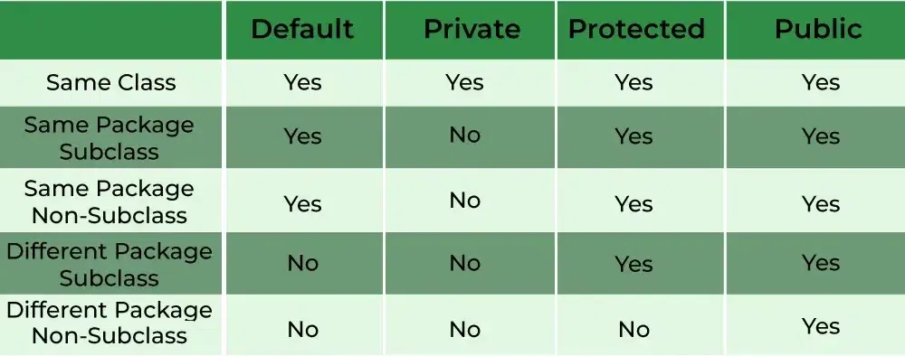
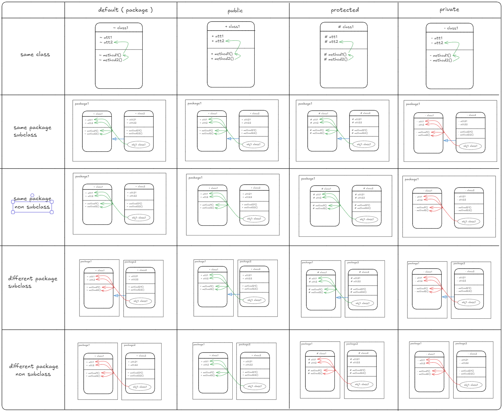
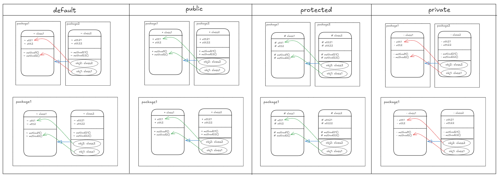

# Notes pour le cours de Java Advancee

## Rappel:

### Notions de base:

#### Common points with other languages:

##### Control structures:

1. For loop:
   Syntax:

```java
for ( initialisation; termination; increment ) {
    statement(s)
}
```

2. While loop:
   Syntax:

```java
while (expression) {
    statement(s)
}
```

3. Do-While loop:
   Syntax:

```java
do {
    statement(s)
} while (expression);
```

4. Conditional statements:
   Syntax:

```java
if (condition) {
    statement(s)
} else if (condition) {
    statement(s)
} else {
    statement(s)
}
```

##### Variables:

1. Declaration:

Syntax: `type variableName = value;` or `type variableName;`

2. Reference, value and primitive types:

On ne manipule pas explicitement les pointeurs/addresses.
Pour les types primitifs, on manipule directement la valeur.
Pour les types références, on manipule une référence à l'objet.

#### L'orienté objet:

##### Classes et objets:

Classe: Modèle pour créer caractéristiques et comportements d'un objet.
Contient 2 types de membress:

- Champs (variables):
  - Variables deffinisant les caractéristiques de l'objet.
- Méthodes (fonctions):
  - Fonctions définissant les comportements de l'objet.

Objet: Instance d'une classe.

##### Definition d'une classe:

Les classes sont logiquemnet regroupées dans des packages.

Exemple:

```java
package nameOfPackage;

public class ClassName { // Besoin de visibilite
    // Champs
    type fieldName; // Besoin de visibilite
    // Méthodes
    type methodName() { //...
        // Code
    }
}

```

##### Constructeurs:

1. Principle:

Un constructeur permet d'instancier une classe en initialisant less valeurs de ses attributs avec dess valeurs pertinentes.

\*Au java, si aucune constructeur n'est défini, un constructeur par défaut est créé **_(implicitement)_**.\*

Definition d'un constructeur:

- Même nom que la classe.
- N'a pas de type de retour.

Exemple:

```java
class Greeter {
    int nbGreetings = 2;
    boolean fr;

    Greeter(boolean fr) {
        this.fr = fr;
    }

    void printHello(){
        // Code
    }
}

```

2. Appel d'un constructeur:

On a 2 facon d'appeler un constructeur:

- Pour initialiser un objet, `new MyClass([params]);`
- Uniquement au sein d'un constructeur, `this([params]);`
  Par exemple:

```java
Greeter (boolean fr, int nbGreetings) {
    this.fr = fr;
    this.nbGreetings = 3;
}

Greeter (boolean fr) {
    this(fr, 2);
}
```

##### Utilisaion and manipulation of objects:

1. Declaration:

It can be declared as: `ClassName objectName;` or `ClassName objectName = new ClassName();`

For initialisation, we can:

- Use a constructor: `ClassName objectName = new ClassName([params]);` or `objectName = new ClassName();`
- Use an other objects: `objectName = otherObject;`

We can also declare and initialise in the same line: `ClassName objectName = new ClassName([params]);`
Example:

```java
Greeter g1;
g1 = new Greeter(true);
Greeter g2 = new Greeter(false);
```

Notons que tous les types primitifs possèdent une classe correspondante (wrapper class).

Par exemple: `int` -> `Integer`, `double` -> `Double`, `char` -> `Character`, etc.

Ces classes a autres methodes comme `parseInt`, `parseDouble`, `toString`, `valueOf`, etc.

2. Access to a member:

From an instance: `myObject.myField`  
From a current instance ( au sein de la classe ): `this.myField`  
From a class: Only a static field: `ClassName.myField`

Example:

```java
Greeter ( boolean fr, int nbGreetings ) {
    this.fr = fr;
    this.nbGreetings = nbGreetings;
}
```

Note that:

- Le constructeur est une sorte de méthodes particulière.
- Pour manipuler, il faut instancier

3. Comparison:

Il éxiste 2 types de comparaisons:

- `==` : Compare les références. ( Ex: `object1 == object2` ). Il retourne true <=> si 2 objets **font référence au même objet en mémoire**.
- Le méthode `equals` : Proposé par tous les objets java. Par défaut, il compare les références. Il pourrait être redéfini.

_Note that:_
_La classe `String` redéfinit la méthode `equals` pour comparer les valeurs._
_Exemple:_

```java
String s1 = "Hello";
String s2 = "Hello";
System.out.println(s1.equals(s2)); // true
System.out.println(s1 == s2); // false (car les références sont différentes)
```

En effet, s1 et s2 représentent les objets different en mémoire meme si les valeurs sont les mêmes.

###### Accessibilié

4 types de visibilité:
Summary


Detail


###### Persistance

1. final:
   Pour un champ, il est initialisé à la construction de l'objet et non modifiable.
2. static:
   Un membre est independant de l'instance de la classe, il devient un membre de la classe et non de l'objet.

Exemple:

```java
public class myClassWithId {
    private static int instanceCounter = 0;
    private final int myId = instanceCounter++;
    public int getMyId() {
        return myId;    
    }
}
```
En main:
```java
myClassWithId c1 = new myClassWithId();
System.out.println(c1.getMyId());
myClassWithId c2 = c1;
System.out.println(c2.getMyId());
myClassWithId c3 = new myClassWithId();
System.out.println(c3.getMyId());
```
Output to be `0 0 1`


##### Dialogue avec l'extérieur

###### Les sorties:

Sortie standard: `System.out`
- out: un champ statique de la classe `System` de type `PrintStream`
- les méthodes sont:
    - println: une méthode de la classe `PrintStream`
    - print: une méthode de la classe `PrintStream`
    - write: une méthode de la classe `PrintStream`

Une sortie d’erreur est également disponible : `System.err`.

###### Les entrées:
`Scanner`, par exemple, se manipule comme suit :
```java
Scanner sc = new Scanner(System.in); //on lit l’entrée standard
Integer i= null; //Integer est une encapsulation deint en faisant
// un type non primitif
i = sc.nextInt(); //Récupération du prochain int de
l’entrée standard
nbGreetings = i
System.out.println("Nous saluerons: " + i + " fois");
sc.close();
```

#### Bonne pratique:
##### Setter, getter et checker:
- Le seter permet de changer la valeur de l’attribut et est nommé setAtt
- Le geter renvoie la valeur de l’attribut et est nommé getAtt
- Le checker est un cas particulier lorsque att est booléen. Son geter se notera isAtt
##### Documentation:
Les tags les plus usités sont :
- @param décrit un paramètre d’une méthode
- @return décrit ce que retourne une fonction
- @throws exception propagée par la méthode
- @author auteur de la classe
- @version version de la classe
- @see référence à d’autres méthodes/classes : @see MyClass#myMethod(prototype)
- @since début de validité de la méthode
- @deprecated indique la méthode va disparaître dans une version future

### Héritage:

L’héritage est un des principes fondamentaux de tout langage objet. 
Il permet de baser une classe A sur une autre (notée ici B), en "récupérant" l’implémentation sans avoir à la dupliquer.

```uml
A --> B
```

En général, A aura au moins les mêmes membres (attributs et méthodes) que B.
- On dit alors que A hérite de B
- A dérive de B
- A est une sous-classe de B
- B est une super-classe de A

En général, si A hérite de B, tous les membres accessibles (public, package ou protected) sur B sont accessible sur A.

On parle d’héritage d’interface. En notant IA et IB l’interface de A et B (vu comme l’ensemble des membres accessibles qu’ils soient méthodes ou champs), on a IA ⊆ IB

Par abus, il arrive de considérer qu’une relation d’héritage implique une relation de sous-typage. Par exemple, si A hérite de B, on pourra considérer qu’A est un sous type de B (e.g. Carré est un sous-type de Rectangle).

#### Usages de l'héritage:

En règle général, l’héritage permet de:
- Spécialiser une classe. On va alors ajouter des fonctionnalités et/ou modifier le
comportement de certaines méthodes.
- Abstraire ou généraliser un ensemble de classes pour les regrouper au sein d’un
même concept (qui sera abstrait ou concret @see abstraction).

##### Spécialisation

Au sein de la classe dérivée, tous les champs `public` et `protected` de la classe mère sont accessibles, `package` se comportant normalement. Les membres `private` de la classe mère ne sont pas accessibles depuis la classe fille.



Toutes les méthodes peuvent être re-définies pour en changer le comportement.
Il également possible d’en changer la visibilité, mais *uniquement pour l’augmenter,jamais la restreindre*

#### Mise en oeuvre:

##### Premières remarques
En java, toute classe hérite implicitement d’Object

* ***En java il n’est pas possible d’hériter de plusieurs classes***

Mot clé final:  
- Pour une classe : elle ne peut être dérivée et donc ne peut avoir de classe fille. On parlera parfois de feuille.
- Pour une méthode : elle ne peut être redéfinie (i.e. son comportement ne peut être changé au sein d’une classe fille).

#####  Classes dérivées : ce qui change du fait de l’héritage

###### Déclaration

Dans la déclaration de la classe fille, on utilisera simplement le mot clé
`extends` pour indiquer un héritage suivi du nom de la classe mère.

```java
public class Safe{
    ...
}
public class SafeWithCode extends Safe{
    ...
}
```
###### Constructeur et initialisation

**Lors de l’instanciation d’une classe dérivée, sa classe mère est également instanciée**
- Si rien n’est précisé, le constructeur *sans argument* de la classe mère est appelée implicitement
- Si la classe mère ne possède pas de constructeur sans argument ou si on souhaite invoquer un autre constructeur, **un constructeur de la classe mère doit être appelé explicitement dans la première ligne de la classe dérivée**. L’appel aux
constructeurs de la classe mère se fait à l’aide du mot-clé super  
Exemple:
```java
public SafeWithCode(int capacity, int code){
    super(); //appel explicite au constructeur sans
    argument de la classe mère Safe
    this.code = code;
}
```
Voir cette exemple:
```java
public SafeWithCode(int capacity, int code){
    //appel implicite au constructeur sans
    argument de la classe mère Safe
    this.code = code;
}
```
On obtient une erreur de compilation car la classe mère Safe ne possède pas de constructeur sans argument.

On peut (et doit) donc faire référence explicitement au dit constructeur :
```java
public SafeWithCode(int capacity, int code){
    super(capacity);
    this.code = code;
}
```
Le comportement général d’un constructeur est donc :
- Construction de l’objet parent et initialisation de ses champs via constructeur
via un appel explicite ou implicite.
- Initialisation des attributs spécifiques à la classe dérivée au sein du constructeur.

Appel au super-constructeur soit toujours fait en premier dans le constructeur de
la classe fille, par exemple le code suivant donnera une erreur
Ce code ne compile pas
```java
public SafeWithCode(int capacity, int code){
    this.code = code;
    super(capacity);
}
```

###### Appel à des membres de la classe mère depuis la classe fille
Pour accéder à des méthodes de la mère au sein de la classe fille, on utilise le mot-clé `super`
Par exemple: 
```java
super.open();
```

###### Redéfinition de méthodes
Si leur comportement est satisfaisant, on NE LES REDÉFINIT PAS.  
Sinon, on décrit le nouveau comportement, en redéclarant la méthode et en donnant sa nouvelle implémentation. On dira alors que la méthode est redéfinie, et on l’indiquera à l’aide du tag `@Override`.
```java
@Override
public void open(int code){
    if(this.code==code) super.open();
    else System.err.println("Wrong code!");
}
```
#### Abstraction:

Certains concepts peuvent être abstraits, c’est à dire qu’ils ne sont pas *pleinement implémentés immédiatement*. Ceci est marqué en java par le mot-clé
abstract.
##### Abstract method

Une méthode abstraite est une méthode qui n’a pas d’implémentation. 
Elle est déclarée avec le mot-clé `abstract` et ne peut être déclarée que dans une classe abstraite.
```java
public abstract boolean payer(int montant);
```

##### Abstract class

###### Déclaration
*Une classe abstraite est une classe contenant au moins une méthode abstraite.*

Exemple:
```java
public abstract class MoyenDePaiement{
    private String nomMoyen;
    public String getNomMoyen(){
        return this.nomMoyen;
    }
    public MoyenDePaiement(String nom){
        this.nomMoyen = nom;
        public abstract boolean payer(int montant);
    }
    public abstract boolean payer(int montant);

}
```

###### Heriter d’une classe abstraite: 

Une classe concrète héritant d’une classe abstraite doit redéfinir toutes les méthodes abstraites de la classe mère. Si ce n’est pas le cas, la classe fille doit être déclarée abstraite.
```java
public class CarteVisa extends MoyenDePaiement{
    //corps de la classe
    //au moins une implémentation de payer
}
```

###### Constructeur et initialisation

Une classe abstraite peut (et doit, au pire implicitement) proposer un ou plusieurs constructeur(s).
Toutefois, *une classe abstraite ne peut pas être directement instanciée par l’appel d’un tel constructeur.*  
Le code suivant ne compile pas
```java
MoyenDePaiement mdp = new MoyenDePaiement("Carte Visa"); //Erreur!
```
##### Interface

Une interface en java ne peut contenir que les éléments suivants :
- des constantes.
- la déclaration de méthodes avec leur signature.
- des méthodes par défaut. 
    - Indiquées par le mot-clé `default` et fournissant une implémentation par défaut de la méthode. 
    - Utilisé principalement en cas d’évolution d’une interface existante lorsqu’une nouvelle méthode est ajoutée. 
    - Si l’onajoute une méthode au sein d’une interface sans en préciser une implémentation par défaut, toute classe implémentant la précédente version de l’interface serait en erreur (car ne proposant pas d’implémentation de la dite méthode).
- des méthodes statiques.
- des types imbriqués. C’est à dire des classes, types énumérés ou interfaces internes.

*Implicitement, toutes les méthodes d’une interface sont `public abstract` .*

Une interface peut être implémentée par un classe abstraite ou concrète, spécifié par le mot-clé `implements`. 
**Une telle classe fournit alors une implémentation de chacune des méthodes déclarées dans l’interface**

Exemple:
```java
public interface IMoyenDePaiement{
    payer(int montant);
}
```
###### Implmentation et heritage d’une interface

Notons que dans le cas d’une classe abstraite, *on ne fournira pas nécessairement,en fait, d’implémentation pour toutes les méthodes* elles peuvent être simplement déclarées abstract . 
On parlera alors parfois de réalisation d’interface plutôt que d’implémentation.

```java
public class CarteVisa implements IMoyenDePaiement
```

* Il est bien sûr possible pour une classe de dériver d’une autre tout en en implémentant une interface. On écrira alors extends avant implements

```java
public class ClasseFille extends ClasseMere implements Interface
```

* Simulation d’héritage multiple 
Il est possible pour une classe d’implémenter plusieurs interfaces.

```java
public class ClasseFille extends ClasseMere
implements Interface1, Interface2, Interface3
```

* Hériter d’une interface
Il est possible pour une interface d’étendre une autre interface.
Le comportement est similaire à un héritage de classe, l’interface fille "récupère" les champs de l’interface mère.

```java
public interface IMoyenDePaiementAvecRemboursement extends IMoyenDePaiement{
    public void rembourser(int montant);
}
```
*L’interface `IMoyenDePaiementAvecRemboursement` définie ci-dessous ne pourra être implémentée que par des classes fournissant une implémentation des méthodes rembourser ET payer*

#### Transtypage, polymorphisme et liason

##### Types
2 types de transtypage:
- Le type reel: type réel de l’objet, c’est à dire en général le **type correspondant au constructeur auquel on a fait appel**.
- Le type déclaré dans le cadre d’une variable faisant référence à un objet, le type
de la variable tel qu’il a été déclaré quand la variable est déclarée.
```java
Safe s; //déclaration de s, type déclaré défini
s = new SafeWithCode(10, 1234); //le type réel de s est à présent SafeWithCode
```
En général, ***le type réel sera considéré à l’exécution, et le type déclaré à la compilation***.

##### Transtypage explicite
1. Transtypage explicite:
```java
int i = 1;
float f = (float) i;
Safe s = (Safe) SafeWithCode(10, 1234);
```

2. Transtypage implicite:
```java
int i = 1;
float f =i;
```
##### Transtypage sur des types non primitifs
1. Transtypage ascendant

Si A est un ancêtre de B, il est toujours possible de transtyper une référence de type B vers A

En effet, en java, la relation d’héritage implique une relation de sous-typage.
B est alors un sous type de A. Ce transtypage peut être fait implicitement.
```java 
Safe s;
s = new SafeWithCode(10, 1234);
```
À la ligne 2, une référence de type SafeWithCode est créée en faisant appel au constructeur, puis elle est castée implicitement en Safe, qui est un ancêtre de SafeWithCode. On parle de transtypage *ascendant implicite*.
- Safe est le type reel
- SafeWithCode est le type déclaré

De la même façon, en considérant les CarteVisa implémentant l’interface IMoyenDePaiement, on pourra écrire :
```java
IMoyenDePaiement imdp = new CarteVisa();
```
2. Transtypage descendant

```java
Safe s;
s = new SafeWithCode(10, 1234);
SafeWithCode sc = (SafeWithCode) s;
```
De tels transtypages doivent toujours être **explicites** et nécessite une certaine vigilance pour ne pas faire d’erreur

```java
Safe s = new Safe(10);
SafeWithCode sc = (SafeWithCode) s; //Problème!
```
Il faut donc vérifier que le type réel de l’objet est compatible avec le type vers lequel on souhaite le caster. Cela peut être fait à l’aide de l’opérateur java `instanceof`.

##### Liason
On considère en général deux types de liaison :
- **La liaison statique** faite au moment de la compilation. Cette liaison s’intéresse aux types déclarés et s’applique typiquement au cas de surcharge en java.
- **La liaison tardive** faite au moment de l’exécution. Cette liaison s’intéresse aux types réels et s’applique typiquement au cas de redéfinition en java.

1. Liason tardive
* *Note*: En java, la liaison sur les redéfinitions de méthode est faite tardivement. On appliquera toujours la définition la plus proche du type réel. C’est à dire :
- dans la classe correspondant au type réel si la méthode y a été redéfini.
- si elle n’y a pas été redéfini, on remonte à son ancêtre et on y cherche une redéfinition.
- ainsi de suite jusqu’à trouver une (re)définition.

Exemple:
```java
Safe s = new SafeWithCode(10,1234);
s.open();
```
Le type réel de s étant `SafeWithCode` et `open()` y étant redéfini, c’est bien le comportement défini dans `SafeWithCode` qui sera exhibé : affichage d’une erreur

2. Liason statique
```java
public class MysteriousSafe extends Safe{
    protected boolean opened = true;
    public MysteriousSafe(int capacity){
        super(capacity);
    }
}
```
Notons que la classe définit un nouvel attribut opened. Plutôt qu’une redéfinition
de l’attribut opened de Safe, il faut le voir comme une duplication. Un objet de type `MysteriousSafe` aura deux champs nommé opened, l’un lié à Safe et initialisé à `faux`, l’autre à `MysteriousSafe` initialisé à `vrai`.

```java
Safe s = MysteriousSafe(10); //transtypage
ascendant implicite
System.out.println(s.opened);
```
Le code ci-dessus affichera `false` car la liaison est faite statiquement, et le type déclaré de s est `Safe`, qui n’a pas d’attribut opened initialisé à `vrai`.

3. Accessbilite
```java
Safe s = SafeWithCode(10,1234); //transtypage ascendant implicite
s.open(1234); //erreur
```
Il produira l’erreur The method open(int) is undefined for the type Safe. Malgré l’existence d’une telle méthode dans SafeWithCode, le compilateur vérifie son existence dans le type déclaré.

Resourdre ce problème en utilisant le transtypage explicite:
```java
Safe s = SafeWithCode(10,1234); //transtypage
ascendant implicite
if (s instanceof SafeWithCode) ((SafeWithCode) s).
open(1234);
else System.out.println("Something very odd happened")
```