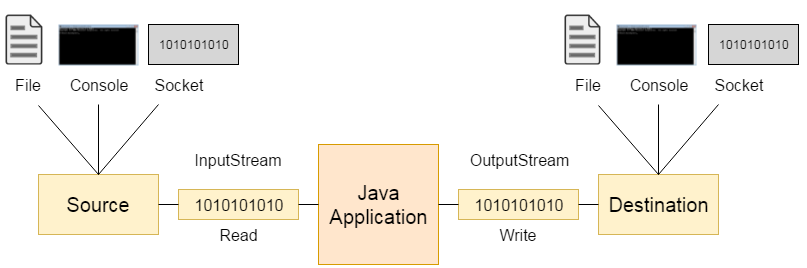
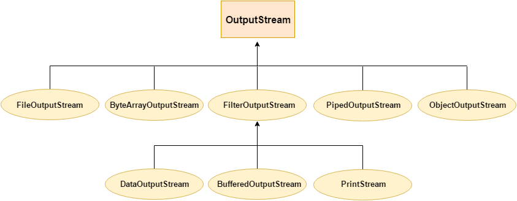
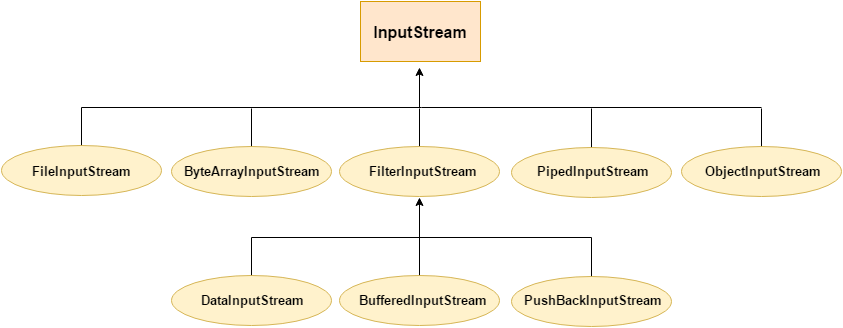
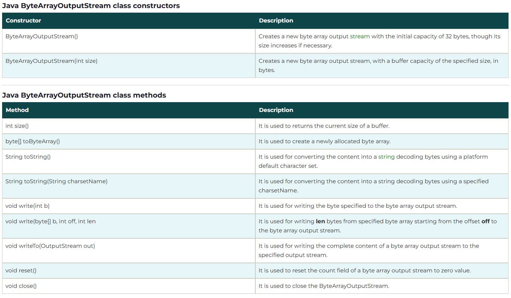

# Notes pour le cours de Java Advancee

## Rappel:

### Notions de base:

#### Common points with other languages:

##### Control structures:

1. For loop:
   Syntax:

```java
for ( initialisation; termination; increment ) {
    statement(s)
}
```

2. While loop:
   Syntax:

```java
while (expression) {
    statement(s)
}
```

3. Do-While loop:
   Syntax:

```java
do {
    statement(s)
} while (expression);
```

4. Conditional statements:
   Syntax:

```java
if (condition) {
    statement(s)
} else if (condition) {
    statement(s)
} else {
    statement(s)
}
```

##### Variables:

1. Declaration:

Syntax: `type variableName = value;` or `type variableName;`

2. Reference, value and primitive types:

On ne manipule pas explicitement les pointeurs/addresses.
Pour les types primitifs, on manipule directement la valeur.
Pour les types références, on manipule une référence à l'objet.

#### L'orienté objet:

##### Classes et objets:

Classe: Modèle pour créer caractéristiques et comportements d'un objet.
Contient 2 types de membress:

- Champs (variables):
  - Variables deffinisant les caractéristiques de l'objet.
- Méthodes (fonctions):
  - Fonctions définissant les comportements de l'objet.

Objet: Instance d'une classe.

##### Definition d'une classe:

Les classes sont logiquemnet regroupées dans des packages.

Exemple:

```java
package nameOfPackage;

public class ClassName { // Besoin de visibilite
    // Champs
    type fieldName; // Besoin de visibilite
    // Méthodes
    type methodName() { //...
        // Code
    }
}

```

##### Constructeurs:

1. Principle:

Un constructeur permet d'instancier une classe en initialisant less valeurs de ses attributs avec dess valeurs pertinentes.

\*Au java, si aucune constructeur n'est défini, un constructeur par défaut est créé **_(implicitement)_**.\*

Definition d'un constructeur:

- Même nom que la classe.
- N'a pas de type de retour.

Exemple:

```java
class Greeter {
    int nbGreetings = 2;
    boolean fr;

    Greeter(boolean fr) {
        this.fr = fr;
    }

    void printHello(){
        // Code
    }
}

```

2. Appel d'un constructeur:

On a 2 facon d'appeler un constructeur:

- Pour initialiser un objet, `new MyClass([params]);`
- Uniquement au sein d'un constructeur, `this([params]);`
  Par exemple:

```java
Greeter (boolean fr, int nbGreetings) {
    this.fr = fr;
    this.nbGreetings = 3;
}

Greeter (boolean fr) {
    this(fr, 2);
}
```

##### Utilisaion and manipulation of objects:

1. Declaration:

It can be declared as: `ClassName objectName;` or `ClassName objectName = new ClassName();`

For initialisation, we can:

- Use a constructor: `ClassName objectName = new ClassName([params]);` or `objectName = new ClassName();`
- Use an other objects: `objectName = otherObject;`

We can also declare and initialise in the same line: `ClassName objectName = new ClassName([params]);`
Example:

```java
Greeter g1;
g1 = new Greeter(true);
Greeter g2 = new Greeter(false);
```

Notons que tous les types primitifs possèdent une classe correspondante (wrapper class).

Par exemple: `int` -> `Integer`, `double` -> `Double`, `char` -> `Character`, etc.

Ces classes a autres methodes comme `parseInt`, `parseDouble`, `toString`, `valueOf`, etc.

2. Access to a member:

From an instance: `myObject.myField`  
From a current instance ( au sein de la classe ): `this.myField`  
From a class: Only a static field: `ClassName.myField`

Example:

```java
Greeter ( boolean fr, int nbGreetings ) {
    this.fr = fr;
    this.nbGreetings = nbGreetings;
}
```

Note that:

- Le constructeur est une sorte de méthodes particulière.
- Pour manipuler, il faut instancier

3. Comparison:

Il éxiste 2 types de comparaisons:

- `==` : Compare les références. ( Ex: `object1 == object2` ). Il retourne true <=> si 2 objets **font référence au même objet en mémoire**.
- Le méthode `equals` : Proposé par tous les objets java. Par défaut, il compare les références. Il pourrait être redéfini.

_Note that:_
_La classe `String` redéfinit la méthode `equals` pour comparer les valeurs._
_Exemple:_

```java
String s1 = "Hello";
String s2 = "Hello";
System.out.println(s1.equals(s2)); // true
System.out.println(s1 == s2); // false (car les références sont différentes)
```

En effet, s1 et s2 représentent les objets different en mémoire meme si les valeurs sont les mêmes.

###### Accessibilié

4 types de visibilité:
Summary


Detail


###### Persistance

1. final:
   Pour un champ, il est initialisé à la construction de l'objet et non modifiable.
2. static:
   Un membre est independant de l'instance de la classe, il devient un membre de la classe et non de l'objet.

Exemple:

```java
public class myClassWithId {
    private static int instanceCounter = 0;
    private final int myId = instanceCounter++;
    public int getMyId() {
        return myId;
    }
}
```

En main:

```java
myClassWithId c1 = new myClassWithId();
System.out.println(c1.getMyId());
myClassWithId c2 = c1;
System.out.println(c2.getMyId());
myClassWithId c3 = new myClassWithId();
System.out.println(c3.getMyId());
```

Output to be `0 0 1`

##### Dialogue avec l'extérieur

###### Les sorties:

Sortie standard: `System.out`

- out: un champ statique de la classe `System` de type `PrintStream`
- les méthodes sont:
  - println: une méthode de la classe `PrintStream`
  - print: une méthode de la classe `PrintStream`
  - write: une méthode de la classe `PrintStream`

Une sortie d'erreur est également disponible : `System.err`.

###### Les entrées:

`Scanner`, par exemple, se manipule comme suit :

```java
Scanner sc = new Scanner(System.in); //on lit l'entrée standard
Integer i= null; //Integer est une encapsulation deint en faisant
// un type non primitif
i = sc.nextInt(); //Récupération du prochain int de
l'entrée standard
nbGreetings = i
System.out.println("Nous saluerons: " + i + " fois");
sc.close();
```

#### Bonne pratique:

##### Setter, getter et checker:

- Le seter permet de changer la valeur de l'attribut et est nommé setAtt
- Le geter renvoie la valeur de l'attribut et est nommé getAtt
- Le checker est un cas particulier lorsque att est booléen. Son geter se notera isAtt

##### Documentation:

Les tags les plus usités sont :

- @param décrit un paramètre d'une méthode
- @return décrit ce que retourne une fonction
- @throws exception propagée par la méthode
- @author auteur de la classe
- @version version de la classe
- @see référence à d'autres méthodes/classes : @see MyClass#myMethod(prototype)
- @since début de validité de la méthode
- @deprecated indique la méthode va disparaître dans une version future

### Héritage:

L'héritage est un des principes fondamentaux de tout langage objet.
Il permet de baser une classe A sur une autre (notée ici B), en "récupérant" l'implémentation sans avoir à la dupliquer.

```uml
A --> B
```

En général, A aura au moins les mêmes membres (attributs et méthodes) que B.

- On dit alors que A hérite de B
- A dérive de B
- A est une sous-classe de B
- B est une super-classe de A

En général, si A hérite de B, tous les membres accessibles (public, package ou protected) sur B sont accessible sur A.

On parle d'héritage d'interface. En notant IA et IB l'interface de A et B (vu comme l'ensemble des membres accessibles qu'ils soient méthodes ou champs), on a IA ⊆ IB

Par abus, il arrive de considérer qu'une relation d'héritage implique une relation de sous-typage. Par exemple, si A hérite de B, on pourra considérer qu'A est un sous type de B (e.g. Carré est un sous-type de Rectangle).

#### Usages de l'héritage:

En règle général, l'héritage permet de:

- Spécialiser une classe. On va alors ajouter des fonctionnalités et/ou modifier le
  comportement de certaines méthodes.
- Abstraire ou généraliser un ensemble de classes pour les regrouper au sein d'un
  même concept (qui sera abstrait ou concret @see abstraction).

##### Spécialisation

Au sein de la classe dérivée, tous les champs `public` et `protected` de la classe mère sont accessibles, `package` se comportant normalement. Les membres `private` de la classe mère ne sont pas accessibles depuis la classe fille.


Toutes les méthodes peuvent être re-définies pour en changer le comportement.
Il également possible d'en changer la visibilité, mais _uniquement pour l'augmenter,jamais la restreindre_

#### Mise en oeuvre:

##### Premières remarques

En java, toute classe hérite implicitement d'Object

- **_En java il n'est pas possible d'hériter de plusieurs classes_**

Mot clé final:

- Pour une classe : elle ne peut être dérivée et donc ne peut avoir de classe fille. On parlera parfois de feuille.
- Pour une méthode : elle ne peut être redéfinie (i.e. son comportement ne peut être changé au sein d'une classe fille).

##### Classes dérivées : ce qui change du fait de l'héritage

###### Déclaration

Dans la déclaration de la classe fille, on utilisera simplement le mot clé
`extends` pour indiquer un héritage suivi du nom de la classe mère.

```java
public class Safe{
    ...
}
public class SafeWithCode extends Safe{
    ...
}
```

###### Constructeur et initialisation

**Lors de l'instanciation d'une classe dérivée, sa classe mère est également instanciée**

- Si rien n'est précisé, le constructeur _sans argument_ de la classe mère est appelée implicitement
- Si la classe mère ne possède pas de constructeur sans argument ou si on souhaite invoquer un autre constructeur, **un constructeur de la classe mère doit être appelé explicitement dans la première ligne de la classe dérivée**. L'appel aux
  constructeurs de la classe mère se fait à l'aide du mot-clé super  
  Exemple:

```java
public SafeWithCode(int capacity, int code){
    super(); //appel explicite au constructeur sans
    argument de la classe mère Safe
    this.code = code;
}
```

Voir cette exemple:

```java
public SafeWithCode(int capacity, int code){
    //appel implicite au constructeur sans
    argument de la classe mère Safe
    this.code = code;
}
```

On obtient une erreur de compilation car la classe mère Safe ne possède pas de constructeur sans argument.

On peut (et doit) donc faire référence explicitement au dit constructeur :

```java
public SafeWithCode(int capacity, int code){
    super(capacity);
    this.code = code;
}
```

Le comportement général d'un constructeur est donc :

- Construction de l'objet parent et initialisation de ses champs via constructeur
  via un appel explicite ou implicite.
- Initialisation des attributs spécifiques à la classe dérivée au sein du constructeur.

Appel au super-constructeur soit toujours fait en premier dans le constructeur de
la classe fille, par exemple le code suivant donnera une erreur
Ce code ne compile pas

```java
public SafeWithCode(int capacity, int code){
    this.code = code;
    super(capacity);
}
```

###### Appel à des membres de la classe mère depuis la classe fille

Pour accéder à des méthodes de la mère au sein de la classe fille, on utilise le mot-clé `super`
Par exemple:

```java
super.open();
```

###### Redéfinition de méthodes

Si leur comportement est satisfaisant, on NE LES REDÉFINIT PAS.  
Sinon, on décrit le nouveau comportement, en redéclarant la méthode et en donnant sa nouvelle implémentation. On dira alors que la méthode est redéfinie, et on l'indiquera à l'aide du tag `@Override`.

```java
@Override
public void open(int code){
    if(this.code==code) super.open();
    else System.err.println("Wrong code!");
}
```

#### Abstraction:

Certains concepts peuvent être abstraits, c'est à dire qu'ils ne sont pas _pleinement implémentés immédiatement_. Ceci est marqué en java par le mot-clé
abstract.

##### Abstract method

Une méthode abstraite est une méthode qui n'a pas d'implémentation.
Elle est déclarée avec le mot-clé `abstract` et ne peut être déclarée que dans une classe abstraite.

```java
public abstract boolean payer(int montant);
```

##### Abstract class

###### Déclaration

_Une classe abstraite est une classe contenant au moins une méthode abstraite._

Exemple:

```java
public abstract class MoyenDePaiement{
    private String nomMoyen;
    public String getNomMoyen(){
        return this.nomMoyen;
    }
    public MoyenDePaiement(String nom){
        this.nomMoyen = nom;
        public abstract boolean payer(int montant);
    }
    public abstract boolean payer(int montant);

}
```

###### Heriter d'une classe abstraite:

Une classe concrète héritant d'une classe abstraite doit redéfinir toutes les méthodes abstraites de la classe mère. Si ce n'est pas le cas, la classe fille doit être déclarée abstraite.

```java
public class CarteVisa extends MoyenDePaiement{
    //corps de la classe
    //au moins une implémentation de payer
}
```

###### Constructeur et initialisation

Une classe abstraite peut (et doit, au pire implicitement) proposer un ou plusieurs constructeur(s).
Toutefois, _une classe abstraite ne peut pas être directement instanciée par l'appel d'un tel constructeur._  
Le code suivant ne compile pas

```java
MoyenDePaiement mdp = new MoyenDePaiement("Carte Visa"); //Erreur!
```

##### Interface

Une interface en java ne peut contenir que les éléments suivants :

- des constantes.
- la déclaration de méthodes avec leur signature.
- des méthodes par défaut.
  - Indiquées par le mot-clé `default` et fournissant une implémentation par défaut de la méthode.
  - Utilisé principalement en cas d'évolution d'une interface existante lorsqu'une nouvelle méthode est ajoutée.
  - Si l'onajoute une méthode au sein d'une interface sans en préciser une implémentation par défaut, toute classe implémentant la précédente version de l'interface serait en erreur (car ne proposant pas d'implémentation de la dite méthode).
- des méthodes statiques.
- des types imbriqués. C'est à dire des classes, types énumérés ou interfaces internes.

_Implicitement, toutes les méthodes d'une interface sont `public abstract` ._

Une interface peut être implémentée par un classe abstraite ou concrète, spécifié par le mot-clé `implements`.
**Une telle classe fournit alors une implémentation de chacune des méthodes déclarées dans l'interface**

Exemple:

```java
public interface IMoyenDePaiement{
    payer(int montant);
}
```

###### Implmentation et heritage d'une interface

Notons que dans le cas d'une classe abstraite, _on ne fournira pas nécessairement,en fait, d'implémentation pour toutes les méthodes_ elles peuvent être simplement déclarées abstract .
On parlera alors parfois de réalisation d'interface plutôt que d'implémentation.

```java
public class CarteVisa implements IMoyenDePaiement
```

- Il est bien sûr possible pour une classe de dériver d'une autre tout en en implémentant une interface. On écrira alors extends avant implements

```java
public class ClasseFille extends ClasseMere implements Interface
```

- Simulation d'héritage multiple
  Il est possible pour une classe d'implémenter plusieurs interfaces.

```java
public class ClasseFille extends ClasseMere
implements Interface1, Interface2, Interface3
```

- Hériter d'une interface
  Il est possible pour une interface d'étendre une autre interface.
  Le comportement est similaire à un héritage de classe, l'interface fille "récupère" les champs de l'interface mère.

```java
public interface IMoyenDePaiementAvecRemboursement extends IMoyenDePaiement{
    public void rembourser(int montant);
}
```

_L'interface `IMoyenDePaiementAvecRemboursement` définie ci-dessous ne pourra être implémentée que par des classes fournissant une implémentation des méthodes rembourser ET payer_

#### Transtypage, polymorphisme et liason

##### Types

2 types de transtypage:

- Le type reel: type réel de l'objet, c'est à dire en général le **type correspondant au constructeur auquel on a fait appel**.
- Le type déclaré dans le cadre d'une variable faisant référence à un objet, le type
  de la variable tel qu'il a été déclaré quand la variable est déclarée.

```java
Safe s; //déclaration de s, type déclaré défini
s = new SafeWithCode(10, 1234); //le type réel de s est à présent SafeWithCode
```

En général, **_le type réel sera considéré à l'exécution, et le type déclaré à la compilation_**.

##### Transtypage explicite

1. Transtypage explicite:

```java
int i = 1;
float f = (float) i;
Safe s = (Safe) SafeWithCode(10, 1234);
```

2. Transtypage implicite:

```java
int i = 1;
float f =i;
```

##### Transtypage sur des types non primitifs

1. Transtypage ascendant

Si A est un ancêtre de B, il est toujours possible de transtyper une référence de type B vers A

En effet, en java, la relation d'héritage implique une relation de sous-typage.
B est alors un sous type de A. Ce transtypage peut être fait implicitement.

```java
Safe s;
s = new SafeWithCode(10, 1234);
```

À la ligne 2, une référence de type SafeWithCode est créée en faisant appel au constructeur, puis elle est castée implicitement en Safe, qui est un ancêtre de SafeWithCode. On parle de transtypage _ascendant implicite_.

- Safe est le type reel
- SafeWithCode est le type déclaré

De la même façon, en considérant les CarteVisa implémentant l'interface IMoyenDePaiement, on pourra écrire :

```java
IMoyenDePaiement imdp = new CarteVisa();
```

2. Transtypage descendant

```java
Safe s;
s = new SafeWithCode(10, 1234);
SafeWithCode sc = (SafeWithCode) s;
```

De tels transtypages doivent toujours être **explicites** et nécessite une certaine vigilance pour ne pas faire d'erreur

```java
Safe s = new Safe(10);
SafeWithCode sc = (SafeWithCode) s; //Problème!
```

Il faut donc vérifier que le type réel de l'objet est compatible avec le type vers lequel on souhaite le caster. Cela peut être fait à l'aide de l'opérateur java `instanceof`.

##### Liason

On considère en général deux types de liaison :

- **La liaison statique** faite au moment de la compilation. Cette liaison s'intéresse aux types déclarés et s'applique typiquement au cas de surcharge en java.
- **La liaison tardive** faite au moment de l'exécution. Cette liaison s'intéresse aux types réels et s'applique typiquement au cas de redéfinition en java.

1. Liason tardive

- _Note_: En java, la liaison sur les redéfinitions de méthode est faite tardivement. On appliquera toujours la définition la plus proche du type réel. C'est à dire :

* dans la classe correspondant au type réel si la méthode y a été redéfini.
* si elle n'y a pas été redéfini, on remonte à son ancêtre et on y cherche une redéfinition.
* ainsi de suite jusqu'à trouver une (re)définition.

Exemple:

```java
Safe s = new SafeWithCode(10,1234);
s.open();
```

Le type réel de s étant `SafeWithCode` et `open()` y étant redéfini, c'est bien le comportement défini dans `SafeWithCode` qui sera exhibé : affichage d'une erreur

2. Liason statique

```java
public class MysteriousSafe extends Safe{
    protected boolean opened = true;
    public MysteriousSafe(int capacity){
        super(capacity);
    }
}
```

Notons que la classe définit un nouvel attribut opened. Plutôt qu'une redéfinition
de l'attribut opened de Safe, il faut le voir comme une duplication. Un objet de type `MysteriousSafe` aura deux champs nommé opened, l'un lié à Safe et initialisé à `faux`, l'autre à `MysteriousSafe` initialisé à `vrai`.

```java
Safe s = MysteriousSafe(10); //transtypage
ascendant implicite
System.out.println(s.opened);
```

Le code ci-dessus affichera `false` car la liaison est faite statiquement, et le type déclaré de s est `Safe`, qui n'a pas d'attribut opened initialisé à `vrai`.

3. Accessbilite

```java
Safe s = SafeWithCode(10,1234); //transtypage ascendant implicite
s.open(1234); //erreur
```

Il produira l'erreur The method open(int) is undefined for the type Safe. Malgré l'existence d'une telle méthode dans SafeWithCode, le compilateur vérifie son existence dans le type déclaré.

Resourdre ce problème en utilisant le transtypage explicite:

```java
Safe s = SafeWithCode(10,1234); //transtypage
ascendant implicite
if (s instanceof SafeWithCode)
((SafeWithCode) s).open(1234);
else System.out.println("Something very odd happened")
```

# Java Avancée

## Testing

### Unit testing

- A very small method you write to test a very small piece of code.
- To make sure, need to write more tests.
- Simple code, one functionality

### Test kezako

Test level:

- Unit test
- Integration test
- System test

Unit test: independant, standalone program that test a software feature
Archi:

- Initialisation: Setting environment needed for the test
- Exercise: Run the code to be tested
- Verification: Check the result ( assert )
- Deactivation: Clean up the environment

Test can and must be defined before devient

### Junit

- JUnit propose un framework pour écrire les classes de tests.
- Un test est une classe qui _hérite_ de la classe TestCase. Par convention le nom de la classe de test est composé du nom de la classe suivi de Test.
- Chaque cas de tests fait l'objet d'une méthode dans la classe de tests.
- Le nom de ces méthodes doit _obligatoirement_ commencer par le préfixe **test**.
- _Remarque_ : dans la **version 3.7** de JUnit, une classe de tests doit obligatoirement posséder un constructeur qui attend un objet de type String en paramètre.
- Chacune de ces méthodes doit avoir les caractéristiques suivantes :
  - elle doit être déclarée **public**
  - elle ne doit renvoyer aucune valeur
  - elle ne doit pas posséder de paramètres.
- Chaque classe de tests doit avoir **obligatoirement** au moins une méthode de test sinon une erreur est remontée par JUnit.
- JUnit recherche, par introspection, les méthodes qui débutent par test, n'ont aucun paramètre et ne retourne aucune valeur. Ces méthodes peuvent lever des exceptions qui sont automatiquement capturées par JUnit qui remonte alors une erreur et donc un échec du cas de tests.
- Dès qu'un test échoue, l'exécution de la méthode correspondante est interrompue et JUnit passe à la méthode suivante.
- Architecture:
  - Initialisation (setup) : mise en place de l'environnement nécessaire à la construction et l'exécution des tests.
  - Exercice : on exécute le programme à tester
  - Vérification (assert) : on compare les résultats de l'exécution du programme à ce qui était attendu
  - Désactivation : on se remet dans l'état initial du système (chaque test doit être autonome)

#### Méthodes Assert

Il existe de nombreuses méthodes de ce type qui sont héritées de la classe `junit.framework.Assert`

`void assertEquals(boolean expected, boolean actual)`
Vérifier l'égalité de deux _valeurs_ de **type primitif** ou objet (en utilisant la méthode equals()). Il existe de nombreuses surcharges de cette méthode pour chaque type primitif, pour un objet de type Object et pour un objet de type String

`void assertFalse(boolean condition)`
Vérifier que la valeur fournie en paramètre est fausse

`void assertNull(Object object)`
Vérifier que l'objet fourni en paramètre soit null

`void assertNotNull(Object object)`
Vérifier que l'objet fourni en paramètre ne soit pas null

`void assertSame(object1, object2)`
Vérifier que les deux objets fournis en paramètre font **référence** à la même entité
Exemples identiques :

```
assertSame("Les deux objets sont identiques", obj1, obj2);
assertTrue("Les deux objets sont identiques ", obj1 == obj2);
```

`void assertNotSame(object1, object2)`
Vérifier que les deux objets fournis en paramètre ne font pas **référence** à la même entité

`void assertTrue(boolean condition)`
Vérifier que la valeur fournie en paramètre est vraie

`void assertArrayEquals(expectedArray, resultArray);`
The assertArrayEquals() method will test whether two arrays are equal to each other.

#### Classe TestCase

- Des méthodes
  - `int countTestCases()` : compte le nombre de tests
  - `void setName(String name)` : donne un nom au test
  - `String getName()` : récupère le nom du test
  - `void setUp()` : Mise en place de l'environnement du test
  - `void tearDown()` : à lancer à la fin du test
  - `TestResult createResult()` : Factory pour un objet TestResult
  - `TestResult run()` : exécute le test
  - `void run(TestResult result)` : exécute le test et récupère les résultats dans result
  - `String toString()` : sérialisation en String du TestCase

#### Classe TestResult

- Des méthodes
  - `void addError(Test test, Throwable t)` : ajout d'une erreur (non prévu)
  - `void addFailure(Test test, AssertionFailedError t)` : ajout d'un échec (prévu)
  - `void endTest(Test test)` : informe que le test a bien terminé
  - `int errorCount()` : compte les erreurs
  - `int failureCount()` : compte les échecs
  - `Enumeration<TestFailure> errors()` : liste les échecs
  - `void startTest(Test test)` : informe qu'on débute le test
  - `void stop()` : informe qu'on arrête le test
  - `void run(TestCase test)` : exécute le test test
  - `int runCount()` : donne le nombre de tests lancés

#### TestSuite

- Des méthodes
  - `void addTest(Test test)` : ajouter un test à la test suite
  - `void addTestSuite(Class<? extends TestCase> testClass)` : ajouter tous les tests de la classe testClass à la testSuite
  - `int countTestCases()` : compte le nombre de tests
  - `int testCount()` : compte le nombre de tests dans la suite
  - `void setName()` : renomme la test suite
  - `String getName()` : donne le nom de la test suite
  - `void run(TestResult result)` : exécute la suite de tests et stocke le résultat dansresult
  - `Test testAt(int index)` : retourne le Test d'indice index
  - `static Test warning(String message)` : retourne un test qui échoue et donne un message d'erreur

#### Les annotations JUnit

- Les annotations
  - `@Test` : dit que la méthode public void qui suit peut être lancée comme un cas de test
  - `@Before` : dit que la méthode public void qui suit doit être lancée avant chaque méthode `@Test` (JUnit4, devenu `@BeforeEach` en JUnit5)
  - `@After` : dit que la méthode doit être lancée après chaque `@Test`
  - `@BeforeClass` : pour une méthode public static void (`@BeforeAll`)
  - `@AfterClass` : pour une méthode public static void
  - `@Ignore` : dit d'ignorer le test (méthode) qui suit
- Paramètres de `@Test`
  - expected = NullPointerException.class (extends java.lang.Throwable)
  - timeout = 100 (en ms)
- Tests paramétrés
  - `@RunWith(Parametrized.class)`

## Java I/O

- OutputStream: Java application uses an output stream to write data to a destination; it may be a file, an array, peripheral device or socket.
- InputStream: Java application uses an input stream to read data from a source; it may be a file, an array, peripheral device or socket.



### OutputStream class

OutputStream class is an **abstract** class. It is the superclass of all classes representing an output stream of bytes. An output stream accepts output bytes and sends them to some sink.
Useful methods of OutputStream:

- `public void write(int)throws IOException` is used to write a byte to the current output stream.
- `public void write(byte[])throws IOException` is used to write an array of byte to the current output stream.
- `public void flush()throws IOException` flushes the current output stream.
- `public void close()throws IOException` is used to close the current output stream.
  

### InputStream class

InputStream class is an **abstract** class. It is the superclass of all classes representing an input stream of bytes.
Useful methods of InputStream:

- `public abstract int read()throws IOException` reads the next byte of data from the input stream. It returns -1 at the end of the file.
- `public int available()throws IOException` returns an estimate of the number of bytes that can be read from the current input stream.
- `public void close()throws IOException` is used to close the current input stream.
  

### FileOutputSteam class

Java FileOutputStream is an output stream used for _writing data to a file_.
If you have to write **primitive values** into a file, use `FileOutputStream` class.
You can write **byte-oriented** as well as character-oriented data through `FileOutputStream` class.
But, for **character-oriented** data, it is preferred to use `FileWriter` than `FileOutputStream`.

Declaration:

```java
public class FileOutputStream extends OutputStream
```

FileOutputStream class methods
`protected void finalize()`: It is used to clean up the connection with the file output stream.
`void write(byte[] ary)`: It is used to write ary.length bytes from the byte array to the file output stream.
`void write(byte[] ary, int off, int len)`: It is used to write `len` bytes from the byte array starting at offset `off` to the file output stream.
`void write(int b)`: It is used to write the specified byte to the file output stream.
`FileChannel getChannel()`: It is used to return the file channel object associated with the file output stream.
`FileDescriptor getFD()`: It is used to return the file descriptor associated with the stream.
`void close()`: It is used to closes the file output stream.

Exemple:

```java
import java.io.FileOutputStream;
public class FileOutputStreamExample {
    public static void main(String args[]){
           try{
             FileOutputStream fout=new FileOutputStream("D:\\testout.txt");
             fout.write(65);
             fout.close();
             System.out.println("success...");
            }catch(Exception e){System.out.println(e);}
      }
}
```

```java
import java.io.FileOutputStream;
public class FileOutputStreamExample {
    public static void main(String args[]){
           try{
             FileOutputStream fout=new FileOutputStream("D:\\testout.txt");
             String s="Welcome to javaTpoint.";
             byte b[]=s.getBytes();//converting string into byte array
             fout.write(b);
             fout.close();
             System.out.println("success...");
            }catch(Exception e){System.out.println(e);}
      }
}
```

### FileInputStream class

Java `FileInputStream` class obtains input bytes from a file.
It is used for reading byte-oriented data (streams of raw bytes) such as image data, audio, video etc.
You can also read character-stream data.
But, for reading streams of characters, it is recommended to use FileReader class.

Some méthodes:
`int available()`: It is used to return the estimated number of bytes that can be read from the input stream.
`int read()`: It is used to read the byte of data from the input stream.
`int read(byte[] b)`: It is used to read up to b.length bytes of data from the input stream and save it to `b`.
`int read(byte[] b, int off, int len)`: It is used to read up to len bytes of data from the input stream and save it to `b`.
`long skip(long x)`: It is used to skip over and discards x bytes of data from the input stream.
`FileChannel getChannel()`: It is used to return the unique FileChannel object associated with the file input stream.
`FileDescriptor getFD()`: It is used to return the FileDescriptor object.
`protected void finalize()`: It is used to ensure that the close method is call when there is no more reference to the file input stream.
`void close()`: It is used to closes the stream.

Exemple:

```java
import java.io.FileInputStream;
public class DataStreamExample {
     public static void main(String args[]){
          try{
            FileInputStream fin=new FileInputStream("D:\\testout.txt");
            int i=fin.read();
            System.out.print((char)i);

            fin.close();
          }catch(Exception e){System.out.println(e);}
         }
        }
```

```java
package com.javatpoint;

import java.io.FileInputStream;
public class DataStreamExample {
     public static void main(String args[]){
          try{
            FileInputStream fin=new FileInputStream("D:\\testout.txt");
            int i=0;
            while((i=fin.read())!=-1){
             System.out.print((char)i);
            }
            fin.close();
          }catch(Exception e){System.out.println(e);}
         }
        }
```

### Java BufferedOutputStream Class

Java BufferedOutputStream class is used for buffering an output stream.
It internally uses buffer to store data.
It adds more efficiency than to write data directly into a stream.
So, it makes the performance fast.

Declaration:

```java
OutputStream os= new BufferedOutputStream(new FileOutputStream("D:\\IO Package\\testout.txt"));
public class BufferedOutputStream extends FilterOutputStream
```

- Java `BufferedOutputStream` class constructors
  - `BufferedOutputStream(OutputStream os)`: It creates the new buffered output stream which is used for writing the data to the specified output stream.
  - `BufferedOutputStream(OutputStream os, int size)`: It creates the new buffered output stream which is used for writing the data to the specified output stream with a specified buffer size.
- Java `BufferedOutputStream` class methods
  - `void write(int b)`: It writes the specified byte to the buffered output stream.
  - `void write(byte[] b, int off, int len)`: It write the bytes from the specified byte-input stream into a specified byte array, starting with the given offset
  - `void flush()`: It flushes the buffered output stream.

Example:

```java
package com.javatpoint;
import java.io.*;
public class BufferedOutputStreamExample{
public static void main(String args[])throws Exception{
     FileOutputStream fout=new FileOutputStream("D:\\testout.txt");
     BufferedOutputStream bout=new BufferedOutputStream(fout);    /* Create a BufferedOutputStream basé sur fout */
     String s="Welcome to javaTpoint.";
     byte b[]=s.getBytes();
     bout.write(b);
     bout.flush();
     bout.close();
     fout.close();
     System.out.println("success");
}
}
```

### Java BufferedInputStream Class

Java BufferedInputStream class is used to read information from stream.
It internally uses buffer mechanism to make the performance fast.
The important points about BufferedInputStream are:

- When the bytes from the stream are skipped or read, the internal buffer automatically refilled from the contained input stream, many bytes at a time.
- When a BufferedInputStream is created, an internal buffer array is created.

Declaration:

```java
public class BufferedInputStream extends FilterInputStream
```

- Java BufferedInputStream class constructors
  - `BufferedInputStream(InputStream IS)`: It creates the BufferedInputStream and saves it argument, the input stream IS, for later use.
  - `BufferedInputStream(InputStream IS, int size)`: It creates the BufferedInputStream with a specified buffer size and saves it argument, the input stream IS, for later use.
- Java BufferedInputStream class methods
  - `int available()`: It returns an estimate number of bytes that can be read from the input stream without blocking by the next invocation method for the input stream.
  - `int read()`: It read the next byte of data from the input stream.
  - `int read(byte[] b, int off, int ln)`: It read the bytes from the specified byte-input stream into a specified byte array, starting with the given offset.
  - `void close()`: It closes the input stream and releases any of the system resources associated with the stream.
  - `void reset()`: It repositions the stream at a position the mark method was last called on this input stream.
  - `void mark(int readlimit)`: It sees the general contract of the mark method for the input stream.
  - `long skip(long x)`: It skips over and discards x bytes of data from the input stream.
  - `boolean markSupported()`: It tests for the input stream to support the mark and reset methods.

Example:

```java
package com.javatpoint;
import java.io.*;
public class BufferedInputStreamExample{
 public static void main(String args[]){
  try{
    FileInputStream fin=new FileInputStream("D:\\testout.txt");
    BufferedInputStream bin=new BufferedInputStream(fin);
    int i;
    while((i=bin.read())!=-1){
     System.out.print((char)i);
    }
    bin.close();
    fin.close();
  }catch(Exception e){System.out.println(e);}
 }
}
```

### Java SequenceInputStream Class

Java SequenceInputStream class is used to read data from **multiple streams**.
It reads data _sequentially_ (one by one).

- Java SequenceInputStream Class declaration

```java
public class SequenceInputStream extends InputStream
```

- Constructors of SequenceInputStream class
  - SequenceInputStream(InputStream s1, InputStream s2): creates a new input stream by reading the data of two input stream in order, first s1 and then s2.
  - SequenceInputStream(Enumeration e): creates a new input stream by reading the data of an enumeration whose type is InputStream.
- Methods of SequenceInputStream class - `int read()`: It is used to read the next byte of data from the input stream. - `int read(byte[] ary, int off, int len)`: It is used to read len bytes of data from the input stream into the array of bytes. - `int available()`: It is used to return the maximum number of byte that can be read from an input stream. - `void close()`: It is used to close the input stream.
  Java SequenceInputStream
  Example:

```java
package com.javatpoint;

import java.io.*;
class InputStreamExample {
  public static void main(String args[])throws Exception{
   FileInputStream input1=new FileInputStream("D:\\testin.txt");
   FileInputStream input2=new FileInputStream("D:\\testout.txt");
   SequenceInputStream inst=new SequenceInputStream(input1, input2);
   int j;
   while((j=inst.read())!=-1){
    System.out.print((char)j);
   }
   inst.close();
   input1.close();
   input2.close();
  }
}
```

Here, we are assuming that you have two files: testin.txt and testout.txt which have following information:
testin.txt:

```
Welcome to Java IO Programming.
```

testout.txt:

```
It is the example of Java SequenceInputStream class.
```

Output:

```
Welcome to Java IO Programming. It is the example of Java SequenceInputStream class.
```

Example:In this example, we are writing the data of two files testin1.txt and testin2.txt into another file named testout.txt.

```java
package com.javatpoint;

import java.io.*;
class Input1{
  public static void main(String args[])throws Exception{
   FileInputStream fin1=new FileInputStream("D:\\testin1.txt");
   FileInputStream fin2=new FileInputStream("D:\\testin2.txt");
   FileOutputStream fout=new FileOutputStream("D:\\testout.txt");
   SequenceInputStream sis=new SequenceInputStream(fin1,fin2);
   int i;
   while((i=sis.read())!=-1)
   {
     fout.write(i);
   }
   sis.close();
   fout.close();
   fin1.close();
   fin2.close();
   System.out.println("Success..");
  }
}
```

Example: If we need to read the data from more than two files, we need to use Enumeration. Enumeration object can be obtained by calling elements() method of the Vector class.
Let's see the simple example where we are reading the data from 4 files: a.txt, b.txt, c.txt and d.txt.

```java
package com.javatpoint;
import java.io.*;
import java.util.*;
class Input2{
public static void main(String args[])throws IOException{
//creating the FileInputStream objects for all the files
FileInputStream fin=new FileInputStream("D:\\a.txt");
FileInputStream fin2=new FileInputStream("D:\\b.txt");
FileInputStream fin3=new FileInputStream("D:\\c.txt");
FileInputStream fin4=new FileInputStream("D:\\d.txt");
//creating Vector object to all the stream
Vector v=new Vector();
v.add(fin);
v.add(fin2);
v.add(fin3);
v.add(fin4);
//creating enumeration object by calling the elements method
Enumeration e=v.elements();
//passing the enumeration object in the constructor
SequenceInputStream bin=new SequenceInputStream(e);
int i=0;
while((i=bin.read())!=-1){
System.out.print((char)i);
}
bin.close();
fin.close();
fin2.close();
}
}
```

### Java ByteArrayOutputStream Class

- Java ByteArrayOutputStream class is used to write **common data**into multiple files.
- In this stream, the data is written into a **byte array** which can be written to multiple streams later.
- The ByteArrayOutputStream **holds a copy** of data and **forwards** it to multiple streams.
- The buffer of ByteArrayOutputStream automatically grows according to data.

Declaration

```java
public class ByteArrayOutputStream extends OutputStream
```



Exemple:

```java
package com.javatpoint;
import java.io.*;
public class DataStreamExample {
public static void main(String args[])throws Exception{
      FileOutputStream fout1=new FileOutputStream("D:\\f1.txt");
      FileOutputStream fout2=new FileOutputStream("D:\\f2.txt");

      ByteArrayOutputStream bout=new ByteArrayOutputStream();
      bout.write(65);
      bout.writeTo(fout1);
      bout.writeTo(fout2);

      bout.flush();
      bout.close();//has no effect
      System.out.println("Success...");
     }
    }
```

Output: `Success...`
f1.txt:`A`
f2.txt:`A`

### Java ByteArrayInputStream Class

It can be used to **read byte array as input stream**.
Java ByteArrayInputStream class contains an **internal buffer** which is used to read byte array as stream. In this stream, the data is read from a byte array.
The buffer of ByteArrayInputStream automatically grows according to data.

Declaration

```java
public class ByteArrayInputStream extends InputStream
```
Constructeur
<table class="alt"><tbody><tr><th>Constructor</th><th>Description</th></tr><tr><td>ByteArrayInputStream(byte[] ary)</td><td>Creates a new byte array input stream which uses <strong>ary</strong> as its buffer array.</td></tr><tr><td>ByteArrayInputStream(byte[] ary, int offset, int len)</td><td>Creates a new byte array input stream which uses <strong>ary</strong> as its buffer array that can read up to specified <strong>len</strong> bytes of data from an array.</td></tr></tbody></table>
Méthods
<table class="alt"><tbody><tr><th>Methods</th><th>Description</th></tr><tr><td>int available()</td><td>It is used to return the number of remaining bytes that can be read from the input stream.</td></tr><tr><td>int read()</td><td>It is used to read the next byte of data from the input stream.</td></tr><tr><td>int read(byte[] ary, int off, int len)</td><td>It is used to read up to len bytes of data from an array of bytes in the input stream.</td></tr><tr><td>boolean markSupported()</td><td>It is used to test the input stream for mark and reset method.</td></tr><tr><td>long skip(long x)</td><td>It is used to skip the x bytes of input from the input stream.</td></tr><tr><td>void mark(int readAheadLimit)</td><td>It is used to set the current marked position in the stream.</td></tr><tr><td>void reset()</td><td>It is used to reset the buffer of a byte array.</td></tr><tr><td>void close()</td><td>It is used for closing a ByteArrayInputStream.</td></tr></tbody></table>

Example:

```java
package com.javatpoint;  
import java.io.*;  
public class ReadExample {  
  public static void main(String[] args) throws IOException {  
    byte[] buf = { 35, 36, 37, 38 };  
    // Create the new byte array input stream  
    ByteArrayInputStream byt = new ByteArrayInputStream(buf);  
    int k = 0;  
    while ((k = byt.read()) != -1) {  
      //Conversion of a byte into character  
      char ch = (char) k;  
      System.out.println("ASCII value of Character is:" + k + "; Special character is: " + ch);  
    }  
  }  
}  
```
Output: 
```
ASCII value of Character is:35; Special character is: #
ASCII value of Character is:36; Special character is: $
ASCII value of Character is:37; Special character is: %
ASCII value of Character is:38; Special character is: &
```

