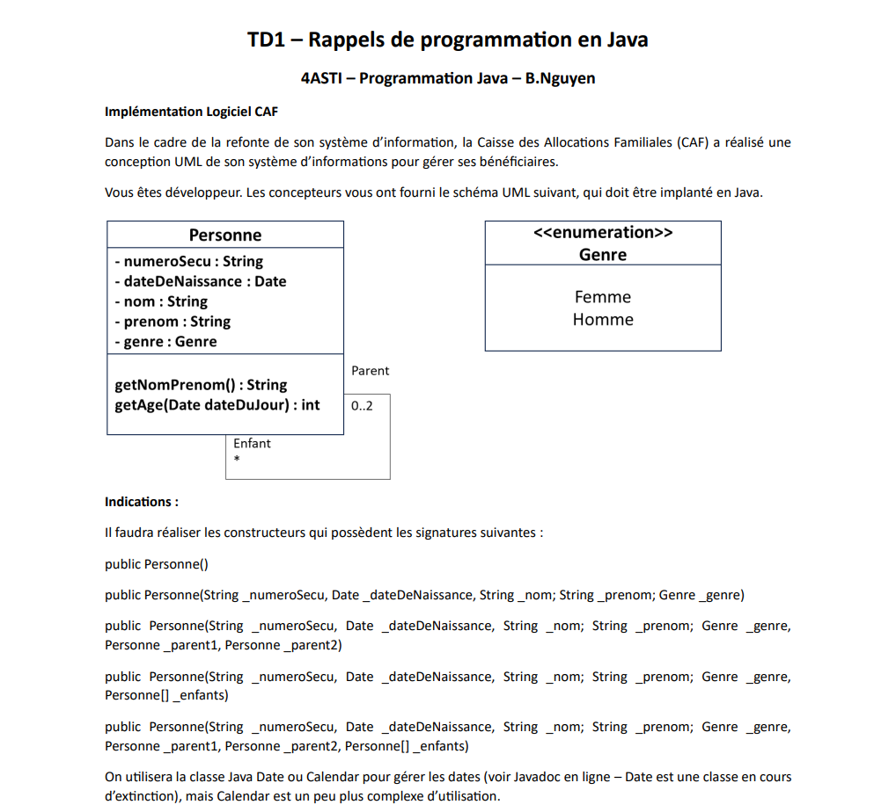
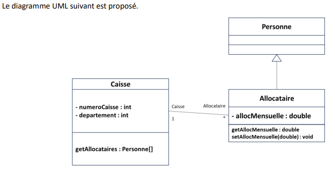

# Correction TD1 - Java Avancé

## Sujet

## Questions:
### Question 1 
#### Réalisez l’enumeration Genre et la classe Personne. Argumentez comment vous allez implémenter les Parents et
Enfants.

On cree une numeration dans la package /SpecialTypes/Genre.java
```java
package SpecialTypes;

public enum Genre {
	Femme,
	Homme,
	
}
```

On cree une classe Personne dans la package /CAF/Personne.java
```java
package CAF;
import SpecialTypes.Genre;
import java.util.Date;
import java.util.ArrayList;

public class Personne {
	private String numeroSecu;
	private Date dateDeNaissance;
	private String nom;
	private String prenom;
	private Genre genre;
	private ArrayList<Personne> parents = new ArrayList<Personne>();
	private ArrayList<Personne> enfants = new ArrayList<Personne>();
	
	

	public Personne() {
		this("", null,"","",null, null, null, new Personne[0]);
	};
	public Personne(String _numeroSecu, Date _dateDeNaissance, String _nom, String _prenom, Genre _genre) {
		this(_numeroSecu, _dateDeNaissance,_nom,_prenom,_genre, null, null, new Personne[0]);
	}
	public Personne (String _numeroSecu, Date _dateDeNaissance, String _nom, String _prenom, Genre _genre,
	Personne _parent1, Personne _parent2){
		this(_numeroSecu, _dateDeNaissance,_nom,_prenom,_genre, _parent1, _parent2, new Personne[0]);
	}
	
	public Personne(String _numeroSecu, Date _dateDeNaissance, String _nom, String _prenom, Genre _genre,
	Personne[] _enfants) {
		this(_numeroSecu, _dateDeNaissance,_nom,_prenom,_genre, null, null, _enfants);
	}
	
	public Personne(String _numeroSecu, Date _dateDeNaissance, String _nom, String _prenom, Genre _genre,
	Personne _parent1, Personne _parent2, Personne[] _enfants) {
		this.numeroSecu = _numeroSecu;
		this.dateDeNaissance = _dateDeNaissance;
		this.nom = _nom;
		this.prenom = _prenom;
		this.genre = _genre;
		if ( _parent1 != null ) {
			this.parents.add(_parent1);
		}
		if ( _parent2 != null ) {
			this.parents.add(_parent2);
		}
		for (int i = 0; i< _enfants.length ; i++) {
			this.enfants.add(_enfants[i]);
		};
	}
}

```
### Question 2
#### Ecrivez un programme principal qui crée plusieurs personnes de la même famille : 4 personnes dont 2 sont les parents des 2 autres.

Dans `/main/Main.java`
```java
package main;
import java.util.Date;

import CAF.Personne;
import SpecialTypes.Genre;

public class Main {
	public static void main( String[] args) {
		Personne mom, dad, son, daughter;
		Personne[] enfants = new Personne[2] ;		
		mom = new Personne( "", null, "", "", Genre.Femme , enfants );
		dad = new Personne( "", null, "", "", Genre.Homme , enfants );
		son = new Personne("", null, "", "", Genre.Homme, mom, dad);
		son = new Personne("", null, "", "", Genre.Femme, mom, dad);
		
	}
}
```

#### Quel constructeur utiliser pour une personne dont on ne connait qu’un seul des 2 parents ? Donnez un exemple.
On utilise le constructeur suivant:
```java
	public Personne (String _numeroSecu, Date _dateDeNaissance, String _nom, String _prenom, Genre _genre,
	Personne _parent1, Personne _parent2)
```
Exemple:
```java
        Personne son = new Personne("", null, "", "", Genre.Homme, mom, null);
```

### Question 3
#### Ecrivez une méthode qui affiche les parents d’une personne.

On defini sur le classe Personne la methode suivante:
```java
	public void printInfo() {
		System.out.print("Personne: "+this+"\n");
		System.out.print("Nom: "+this.nom+"\n");
		System.out.print("Prenom: "+this.prenom+"\n");
		
	}
	
	public void getParents() {
		System.out.print("Les parents sont: \n");
		for (int i = 0; i < this.parents.size(); i++ ) {
			this.parents.get(i).printInfo();
		}
	}
```
On le teste dans le programme principal:
```java
public class Main {
	public static void main( String[] args) {
		Personne mom, dad, son, daughter;
		Personne[] enfants = new Personne[2] ;		
		mom = new Personne( "", null, "Aniston", "Jennifer", Genre.Femme , enfants );
		dad = new Personne( "", null, "Brit", "Patt", Genre.Homme , enfants );
		son = new Personne("", null, "", "", Genre.Homme, mom, dad);
		daughter = new Personne("", null, "", "", Genre.Femme, mom, dad);
		son.getParents();
	};	
}
```
L'output est:
```java
Les parents sont:
Les parents sont: 
Personne: CAF.Personne@50040f0c
Nom: Aniston
Prenom: Jennifer
Personne: CAF.Personne@4d405ef7
Nom: Brit
Prenom: Patt
```

### Question 4
#### On souhaite créer une 2e classe qui représente une caisse départementale pour les allocations, et qui contiendra l’ensemble des informations relatives aux personnes de cette caisse. On décide d’utiliser l’héritage pour représenter une personne qui est allocataire d’une classe.



**Implémentez ces classes, en réfléchissant bien au choix que vous faites pour représenter les allocataires, les caisses, et les constructeurs des classes Caisse et Allocataire.**\


